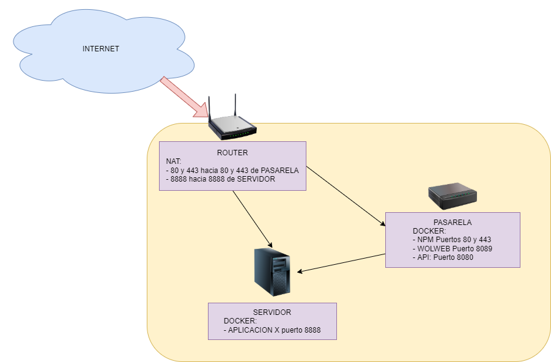

# Arrancar y detener equipos en remoto

En algunas situaciones puede resultar interesante poder encender un PC en remoto, tanto desde la propia LAN del equipo, como desde otra red e incluso desde Internet. 

Desde la propia LAN es sencillo utilizando las herramientas de Wake-On-LAN disponibles en los diversos sistemas operativos, pero desde otra LAN (Otro dominio de broadcast) puede ser más complejo.

Además hay que tener en consideración que el equipo a encender debe permitir tanto desde la BIOS como desde el sistema operativo, las operaciones de WoL. Desde la BIOS es obvio, dado que estando apagado, debe mantener activa la tarjeta de red para detectar el Magic Packet, que produce el encendido del equipo.

En el proyecto se incluye un ejemplo de como proteger una aplicación que a priori no tiene control de acceso, incluyendo cifrado y control de usuarios mediante Nginx, así como un ejemplo de como crear una sencilla API usando Python que nos permite lanzar comandos a equipos remotos.

## Prerequisitos

Para poder montar la solución completamente operativa necesitamos ciertos conocimientos y servicios.

* Disponer de un nombre de dominio apuntando a nuestra IP pública. Si pretendemos que esta solución sea accesible desde Internet y con un certificado SSL de Let's Encrypt, nuestra IP pública debe ser apuntada desde un nombre DNS (FQDN) válido. Esta IP puede ser dinámica, pero el nombre deberá ser actualizado a dicha IP. Hay servicios gratuitos para este tipo de necesidades.

* La propuesta puede alterarse con los conocimientos adecuados, pero lo que proponemos requiere de un router y acceso al mismo para poder crear las rutas NAT necesarias, es decir encaminar las peticiones a determinados puertos, hacia determinadas IPs internas y puertos.

* Necesitas un par de equipos. La idea es disponer de un equipo de bajo consumo, que podría ser una raspberry, y un equipo con mejores prestaciones que será activado solo en caso de necesidad. 

* Para no extenderme no detallaré como usar GIT, DOCKER o Docker-compose. Estas aplicaciones las necesitarás instalar en el equipo pasarela.

## Preparar el equipo para ser encendido con WoL

### BIOS

Acceder a la BIOS y localizar la opción que permite habilitar el Wake-On-LAN o WoL. Cada BIOS es un mundo, pero dado que tienen opciones muy limitadas, no debería ser muy complejo localizar el menú y la opción para activarlo.

### Sistema operativo

También es necesario que el sistema operativo sea preparado para que realice un apagado apropiado.

Obviaré las instrucciones para Windows, ya que como usa ventanas y checkboxes para todo es "muy fácil". Suerte.

En un equipo linux debemos tener en consideración como se gestionan las interfaces de red. Las opciones que se me ocurren son: NetworkManager, si estás empleando una distribución de tipo Desktop o Netplan, si estás empleando una distribución de tipo Server.

Instalaremos la aplicación `ethtool`. Con esta aplicación podemos verificar si está operativo el WoL en nuestro sistema (Mi tarjeta de red tiene el identificados enp3s0, en cada sistema puede variar):
`sudo ethtool enp3s0 | grep Wake`

Si está inactivo aparecerán las líneas:
```bash
        Supports Wake-on: pumbg
        Wake-on: d
```

Lo que debemos verificar es si aparece la **g** o aparece la letra **d**, ya que en el segundo caso estará inactiva.

Vemaos las soluciones para cada caso.

**a) NetworkManager**

Es sencillo verificar esta opción, basta con ejecutar `systemctl status NetworkManager`. Si aparece activo, se está empleando esta solución para la gestión de la red. Lo más sencillo es usar el entorno gráfico, pero no he encontrado las opciones para su configuración en entorno gráfico. 

Para activarlo usamos el siguiente comando: 
`sudo ethtool -s enp3s0 wol g`

Si está activo aparecerán las líneas:
```bash
        Supports Wake-on: pumbg
        Wake-on: g
```

**b) /etc/network/interfaces**

Si tenemos presente el mencionado fichero, en éste se determina la configuración de los interfaces de red. Para asegurar que en el arranque se se activa el WoL debemos incluir la línea `up ethtool -s eth0 wol g` en la configuración del interfaz.

**c) Netplan**

Si empleamos Netplan, debemos configurar el sistema a través del fichero `/etc/netplan/xxxxxxx.yml`. Cada implementación tendrá un nombre diferente. Como primer paso averiguamos la MAC ADDRESS de nuestra tarjeta con `ifconfig enp3s11 | grep ether`. Usaremos la mac para incluirla en el fichero de netplan con un aspecto similar al siguiente:
```bash
network:
  ethernets:
    enp3s11:
      match:
        macaddress: 50:e5:49:b3:fc:97
      dhcp4: true
      wakeonlan: true
  version: 2
```

Preparada la configuración basta con ejecutar los comandos de generar y aplicar:
```bash
sudo netplan generate
sudo netplan apply
```

## Pasarela de arranque y parada

Ahora toca preparar la *pasarela* de arranque y parada para la red, configurar el router de entrada, para encaminar los puertos y la aplicación que correrá nuestro servidor.



### Configurar el router

La idea de esta propuesta es permitir que desde Internet sea posible acceder a un equipo de bajo consumo, que he llamado `pasarela`, que encaminará el tráfico de peticiones de encendido y apagado de otros equipos. Además, la propuesta contempla que en el denominado `servidor` dispongamos de una aplicación que pretendemos sea accesible desde Internet (servidor de ficheros, claves, juegos, etc).

Para ello debemos de configurar el router, en el apartado de NAT o Servidores virtuales, port tiggers o como se llame en cada solución. 

1. Encaminaremos el puerto 80 y el puerto 443 hacia el equipo de bajo consumo. Usamos los puertos estándar ya que la pasarela nos permitirá dirigir las peticiones a otras aplicaciones o servicios usando autenticación por usuarios, y cifrado SSL. Debemos usar los puertos estándar ya que es necesario el puerto 80 para la correcta verificación que realizará Let's Encrypt y el puerto 443, dado que muchas redes bloquean el acceso a puertos no estándares. Emplear puertos no estándar es una *protección cutre e inútil*.

2. Encaminaremos el puerto 8888 (esto es un ejemplo) al puerto 8888 (p.e.) y la IP de nuestro denominado `servidor`. En este podemos levantar un servicio en dicho puerto para la aplicación (espero que sobre docker :smile:) que pretendemos tener accesible en determinados momentos. En la propia aplicación debemos implementar las medidas de seguridad adecudas (cifrado, autenticación, autorización y registros)

Los servicios o aplicaciones encaminadas a la pasarela por el puerto 443 las podemos proteger tanto con el cifrado SSL como por el uso de usuario y contraseña a través de la solución de Nginx Proxy Manager. Este es el caso de las APIs que publicaremos para en encender y apagar.

### Configurar la pasarela

Para configurar la `pasarela` vamos a emplear varios contenedores:

* NPM: Nginx Proxy Manager nos permitirá obtener el certificado SSL para nuestra IP pública, de forma que podremos usar cifrado SSL en las comunicaciones y con un certificado válido. Además nos permite establecer diferentes rutas hacia diferentes servicios. También lo utilizaremos como sistema de autenticación de usuarios para acceso a los servicios publicados en cada ruta.

* wolweb: Es una solución creada y publicada en el repositorio: https://github.com/sameerdhoot/wolweb. Está basada en GO y tiene una variación mínima que fue necesaria dado que el contenedor del repositorio original no estaba funcionando.

* API: Es un contenedor muy simple que emplea python para crear una API muy sencilla que nos permitirá el apagado remoto.  

Cada uno de los contenedores se puede emplear independientemente, por eso mantendré separados los mismos en diferentes ficheros docker-compose.yml. La solución de apagado (contendor API) se podría emplear para el encendido, pero me ha parecido muy interesante la solución `wolweb` y por eso la he incluido.

A) **NPM**

Una vez levantado el contenedor podremos acceder al servicio en el puerto configurado en el fichero docker-compose.yml. Para ponerlo en marcha ejecutamos docker-compose up -d desde el directorio `npm`.

Los pasos que os recomiendo seguir es:

1. Crear un certificado SSL de Let's Encrypt en el menu SSL Certificates.

2. Crear una lista de acceso con los usuarios que podrán usar las llamadas API. Os recomiendo permitir todas las direcciones IP, ya que esta ACL es para controlar usuarios y no IPs de origen.

3. Crear el Proxy Host. El truco está en crear `Custom Locations`, no nos importa demasiado el encaminamiento por defecto. Pero ojo a donde lo apuntáis, que será accesible públicamente. 

4. En las localizaciones pondremos la ruta de `/wolweb/wake`, la encaminamos a la IP de nuestra `pasarela` con la misma ruta añadida tras la IP. El puerto destino en este caso es el 8089, determinado por el contenedor `wolweb`.

5. Debemos personalizar la configuración de la `Custom Location` pinchando en la rueda dentada para incluir el control de acceso con las siguientes líneas. MUY IMPORTANTE: el número tras la ruta `data/access` debe coincidir con el número que os proporciona vuestra lista de acceso creada en el paso 2. El fichero de la ACL está visible bajo el directorio `/npm/.datos/npm/access`
```bash
auth_basic "Authorization required";
auth_basic_user_file /data/access/2;
proxy_set_header Authorization "";
deny all;
satisfy any;
```

6. No os olvidéis de seleccionar la pestaña SSL para seleccionar el certificado creado en el paso 1 y marcar la opción `Force SSL`

7. Repetimos los pasos 4 y 5 para la localización `wolweb/sleep`. En esta ocasión apuntamos a la IP de nuestra pasarela y el puerto conficurado en el docker-compose del contenedor `api`

B) **wolweb**

Es una aplicación obtenida del repositorio https://github.com/sameerdhoot/wolweb donde he incluido las siguientes líneas en el fichero Dockerfile. 
```Dockerfile
# Error "cannot find main module"
RUN go mod init wolweb &&\
    go mod tidy
```

Para poner en marcha este contenedor requiere primero crear la imagen y despúes ponerla en marcha, pero la magia de docker-compose se encarga de ello con el comando `docker-compose up -d` desde el directorio `wolweb`

Esta aplicación es muy interesante y os permite incorporar nuevos equipos desde su interfaz. Desde la misma LAN podéis acceder usando la IP de la pasarela y el puerto 8089, en la ruta **/wolweb**

C) **api**

Esta es un contenedor muy simple con una API creada con el módulo FastAPI de Python. Dado que está el código Python y su simplicidad, veréis que podéis crear de forma sencilla APIs para otras acciones. Incluso para reemplazar el contenedor `wolweb`. 

Es importante que tengáis en cuenta que en el directorio `api/.ssh/known_hosts` debéis incluir las líneas adecuadas de vuestro fichero `$HOME\.ssh\known_hosts`. Estas líneas se crean al acceder por primera vez a un host remoto usando ssh. Aunque es posible copiar el fichero entero no lo recomiendo por motivos de seguridad. También podéis obtener las líneas a incluir mediante el comando `ssh-keyscan \<IP_Servidor\>`

Como este servicio accede por SSH a vuestro equipo para apagarlo, es necesario incluir los datos del usuario y password para el acceso. Además he detectado que es necesario que este usuario esté incluido en el fichero /etc/sudoers de manera que no requiera password para elevar los privilegios. Se puede realizar con la siguiente línea:
```s
usuario     ALL=(ALL) NOPASSWD:ALL
```

## Referencias

https://help.ubuntu.com/community/WakeOnLan

https://help.ubuntu.com/community/NetworkManager

https://ubuntuforums.org/showthread.php?t=2394211

https://github.com/sameerdhoot/wolweb
